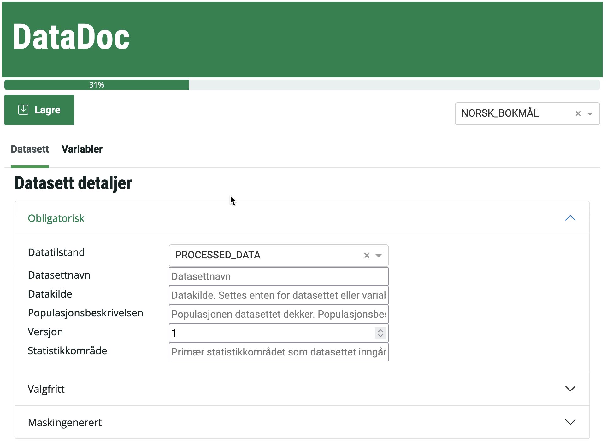

# Datadoc

   

Document datasets in Statistics Norway

## Usage



### From Jupyter

1. Open <https://jupyter.dapla-staging.ssb.no> or another Jupyter Lab environment
1. Run `pip install ssb-datadoc` in the terminal
1. Upload a dataset to your Jupyter server (e.g. <https://github.com/statisticsnorway/datadoc/blob/master/klargjorte_data/person_data_v1.parquet>)
1. Run `from datadoc import main; main("./person_data_v1.parquet")` in a notebook
1. Datadoc will open in a new tab

## Contributing

### Prerequisites

- Python >3.8 (3.10 is preferred)
- Poetry, install via `curl -sSL https://install.python-poetry.org | python3 -`

### Dependency Management

Poetry is used for dependency management. [Poe the Poet](https://github.com/nat-n/poethepoet) is used for running poe tasks within poetry's virtualenv. Upon cloning this project first install necessary dependencies, then run the tests to verify everything is working.

#### Install all dependencies

```shell
poetry install
```

### Add dependencies

#### Main

```shell
poetry add <python package name>
```

#### Dev

```shell
poetry add --group dev <python package name>
```

### Run tests

```shell
poetry run poe test
```

### Run project locally

To run the project locally:

```shell
poetry run poe datadoc "gs://ssb-staging-dapla-felles-data-delt/datadoc/klargjorte_data/person_data_v1.parquet"
```

### Run project locally in Jupyter

To run the project locally in Jupyter run:

```shell
poetry run poe jupyter
```

A Jupyter instance should open in your browser. Open and run the cells in the `.ipynb` file to demo datadoc.

### Bump version

```shell
poetry run poe bump-patch-version
```

> :warning: Run this on the default branch

This command will:

1. Increment version strings in files
1. Commit the changes
1. Tag the commit with the new version

Then just run `git push origin --tags` to push the changes and trigger the release process.
