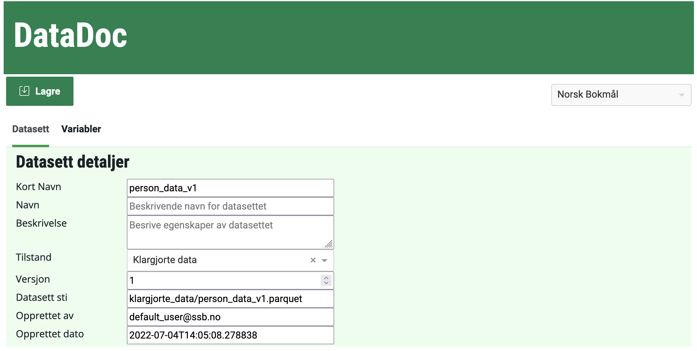

# DataDoc

Document datasets in SSB

## Usage example

1. Clone this repo to your Jupyter instance
1. Open the `DataDoc.ipynb` Notebook and run the cell to see the example dataset
1. Run `%run -i datadoc/DataDocDash.py --dataset-path ./path/to/your/dataset` to run Datadoc on a dataset of your choosing.
1. Complete metadata as you desire
1. Click `Lagre` to save your metadata together with your dataset



## Contributing

### Dependency Management

Poetry is used for dependency management.

To install all required dependencies in a virtual environment run `poetry install`. To add a new dependency to the project run `poetry add <package name>`.

### Run project locally in Jupyter

To run the project locally in Jupyter run:

```bash
poetry shell
ipython kernel install --user --name="datadoc"
jupyter notebook
```

A Jupyter instance should open in your browser. Once there, open the `*.ipynb` file. Before running it, select the correct interpreter via `Kernel > Change Kernel > datadoc`.

### Run tests

1. Install dev dependencies (see [Dependency Management](#dependency-management))
1. Run `poetry shell` to open a shell in the Virtual Environment for the project
1. Run `pytest` in the root of the project
